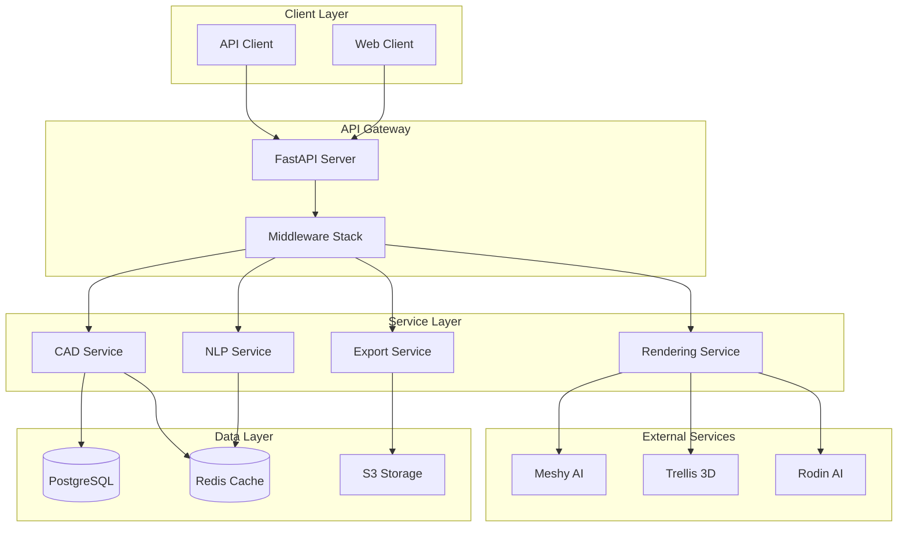

# Text-to-CAD Backend Architecture

## System Overview

The Text-to-CAD backend is a scalable FastAPI-based microservice architecture designed to process natural language architectural descriptions and generate professional CAD models. The system supports multiple complexity levels (L0-L3) from simple shapes to complex structures like the Oculus or Dubai's "The Line".

## Architecture Diagram



## Service Boundaries

### 1. NLP Processing Service
**Responsibility**: Natural language understanding and entity extraction
- Architectural entity recognition
- Intent classification (CREATE, MODIFY, REMOVE, QUERY)
- Dimension extraction and unit conversion
- Constraint extraction and validation
- Building code compliance checking

### 2. CAD Generation Service
**Responsibility**: 3D geometry creation and manipulation
- Parametric model generation
- Boolean operations (CSG)
- NURBS surface generation
- Mesh optimization
- Multi-format geometry representation

### 3. Rendering Service
**Responsibility**: 3D visualization and preview generation
- Real-time preview generation
- Material and texture application
- Lighting and shadow calculation
- Progressive quality enhancement
- External API integration with fallback

### 4. Export Service
**Responsibility**: File format conversion and delivery
- Multi-format export (STEP, IFC, STL, OBJ, DXF)
- 2D technical drawing generation
- Bill of Materials (BOM) generation
- Batch export capabilities
- Cloud storage integration

## API Design

### Base URL
```
https://api.text-to-cad.com/api/v1
```

### Authentication
JWT Bearer token authentication with refresh token rotation.

### API Endpoints

#### Text Processing
```http
POST /api/v1/text/process
Content-Type: application/json

{
  "text": "Create a 10m x 15m office with two windows",
  "complexity_level": 1,
  "context": {
    "building_type": "commercial",
    "location": "urban"
  }
}

Response: 200 OK
{
  "success": true,
  "intent": "CREATE",
  "entities": [...],
  "constraints": [...],
  "validation": {...},
  "processing_time_ms": 145
}
```

#### CAD Generation
```http
POST /api/v1/cad/generate
Content-Type: application/json

{
  "project_name": "Modern Office",
  "complexity_level": 2,
  "operations": [...],
  "materials": {...},
  "constraints": {...}
}

Response: 202 Accepted
{
  "project_id": "550e8400-e29b-41d4",
  "status": "processing",
  "model_url": "/api/v1/cad/project/550e8400",
  "estimated_completion": "2025-09-14T10:30:00Z"
}
```

#### Export
```http
GET /api/v1/export/{project_id}?format=STEP&quality=high

Response: 200 OK
Content-Type: application/step
Content-Disposition: attachment; filename="project.step"
[Binary STEP file data]
```

## Database Schema

### Core Tables

```sql
-- Projects table
CREATE TABLE projects (
    id UUID PRIMARY KEY,
    name VARCHAR(255) NOT NULL,
    user_id UUID REFERENCES users(id),
    complexity_level INTEGER DEFAULT 0,
    status VARCHAR(50) DEFAULT 'draft',
    model_data JSONB,
    created_at TIMESTAMP DEFAULT NOW(),
    updated_at TIMESTAMP DEFAULT NOW()
);

-- Indexes
CREATE INDEX idx_projects_user_id ON projects(user_id);
CREATE INDEX idx_projects_status ON projects(status);
CREATE INDEX idx_projects_created_at ON projects(created_at DESC);
```

## Caching Strategy

### Redis Cache Layers

1. **NLP Result Cache** (TTL: 1 hour)
   - Key: `nlp:process:{text_hash}:{complexity}`
   - Stores processed NLP results

2. **CAD Model Cache** (TTL: 24 hours)
   - Key: `cad:model:{project_id}`
   - Stores generated geometry data

3. **Render Preview Cache** (TTL: 12 hours)
   - Key: `render:preview:{project_id}:{quality}`
   - Stores rendered images

4. **Export Cache** (TTL: 6 hours)
   - Key: `export:{project_id}:{format}:{quality}`
   - Stores exported files

### Cache Invalidation
- Project modification triggers cache invalidation
- Pattern-based invalidation for related entries
- Automatic TTL-based expiration

## Performance Optimization

### 1. Database Optimization
- Connection pooling (10 min, 50 max connections)
- Prepared statements for common queries
- JSONB indexing for model data
- Partitioning for large tables (>10M rows)

### 2. Async Processing
- FastAPI async endpoints
- Background tasks with Celery
- WebSocket for real-time updates
- Streaming responses for large files

### 3. Rate Limiting
- 100 requests/minute per IP (default)
- 1000 requests/minute per authenticated user
- Graduated limits based on user tier

## Scaling Considerations

### Horizontal Scaling
- Stateless API servers (can scale to N instances)
- Redis cluster for cache distribution
- PostgreSQL read replicas for query distribution
- S3 for distributed file storage

### Vertical Scaling Points
- NLP processing (CPU-intensive)
- CAD generation (Memory-intensive)
- 3D rendering (GPU-beneficial)

### Bottleneck Mitigation
1. **NLP Processing**: Cache results, batch processing
2. **CAD Generation**: Queue-based processing, worker pools
3. **File Export**: Pre-generate common formats, CDN distribution
4. **Database**: Connection pooling, query optimization, caching

## Security Patterns

### Authentication & Authorization
- JWT tokens with 7-day expiration
- Refresh token rotation
- Role-based access control (RBAC)
- API key authentication for service-to-service

### Rate Limiting
- IP-based for anonymous users
- Token-based for authenticated users
- Endpoint-specific limits
- DDoS protection via Cloudflare

### Data Security
- TLS 1.3 for all communications
- Encryption at rest for sensitive data
- Input validation and sanitization
- SQL injection prevention via ORM

## Deployment Architecture (Render.com)

### Service Configuration
```yaml
services:
  - web: FastAPI application (4 workers)
  - worker: Celery background tasks (2 workers)
  - database: PostgreSQL 15 (1GB RAM, 10GB storage)
  - cache: Redis (0.5GB RAM, 25 connections)
```

### Environment Variables
- `DATABASE_URL`: PostgreSQL connection string
- `REDIS_URL`: Redis connection string
- `SECRET_KEY`: JWT signing key
- `SENTRY_DSN`: Error tracking
- External API keys (Meshy, Trellis, Rodin)

### Health Checks
- `/health`: Basic health check
- `/ready`: Readiness probe (checks DB/Redis)
- `/metrics`: Prometheus metrics endpoint

## Monitoring & Observability

### Metrics (Prometheus)
- Request rate and latency
- Error rate by endpoint
- Cache hit/miss ratio
- Background job queue depth

### Logging (Structured)
- Request/response logging
- Error tracking with context
- Performance metrics
- Audit trail for modifications

### Error Tracking (Sentry)
- Exception capture with context
- Performance monitoring
- Release tracking
- User feedback integration

## Technology Stack

### Core
- **Runtime**: Python 3.11
- **Framework**: FastAPI 0.104.1
- **ASGI Server**: Uvicorn with Gunicorn

### Data Storage
- **Database**: PostgreSQL 15
- **Cache**: Redis 7.0
- **File Storage**: AWS S3 / Local FS

### Processing Libraries
- **NLP**: spaCy 3.7, Transformers 4.35
- **CAD**: OpenCASCADE Python, Trimesh
- **Export**: ezdxf, ifcopenshell

### Infrastructure
- **Container**: Docker (multi-stage build)
- **Orchestration**: Docker Compose (dev), Kubernetes (prod)
- **CI/CD**: GitHub Actions
- **Hosting**: Render.com (PaaS)

## API Rate Limits

| Tier | Requests/min | Requests/day | Max File Size | Concurrent Jobs |
|------|-------------|--------------|---------------|-----------------|
| Free | 10 | 100 | 10MB | 1 |
| Basic | 60 | 1,000 | 50MB | 3 |
| Pro | 300 | 10,000 | 100MB | 10 |
| Enterprise | Unlimited | Unlimited | 500MB | Unlimited |

## Example Implementation Flow

1. **Text Input**: "Create a two-story house with 4 bedrooms"
2. **NLP Processing**: Extract entities, intent, dimensions
3. **CAD Generation**: Create parametric model
4. **Validation**: Check building codes
5. **Rendering**: Generate 3D preview
6. **Export**: Provide download links
7. **Storage**: Save to database and S3

## Future Enhancements

1. **WebAssembly Integration**: Client-side CAD processing
2. **GraphQL API**: Flexible query interface
3. **Real-time Collaboration**: WebRTC for shared editing
4. **ML Model Training**: Custom entity recognition
5. **Plugin System**: Third-party integrations
6. **Mobile SDK**: iOS/Android native support